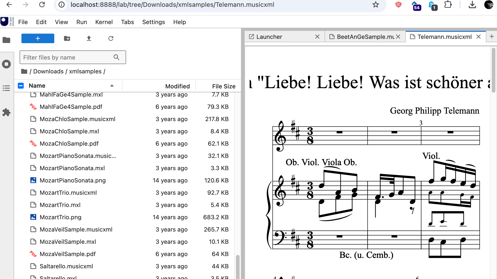

# jupyterlab_osmd

First attempt at JupyterLab mime renderer for MusicXML (`.muscixml` / mime type `application/vnd.recordare.musicxml` ) using [OpenSheetMusicDisplay](https://github.com/opensheetmusicdisplay/opensheetmusicdisplay/). *See also [MusicXML Renderer for JupyterLab Extension using OpenSheetMusicDisplay (OSMD)](https://blog.ouseful.info/2024/11/20/musicxml-renderer-for-jupterlab-extension/).*

*Works a bit...*



`pip install jupyterlab-osmd`

Double click on a `.musicxml` file in the JupyterLab file browser and it should render using OSMD.

Python API:

```python
# Minimally
def OSMD(data=''):
    bundle = {}
    bundle['application/vnd.recordare.musicxml'] = data
    display(bundle, raw=True)

# A far more elaborate version available as:
#from jupyterlab_osmd import OSMD
# This supports:
# - MusicXML string
# - path to .musicxml or compressed .mxl file
# - URL to musicxml file

with open("Downloads/xmlsamples/Telemann.musicxml", 'r') as f:
    d = f.read()

OSMD(d)
```

## Requirements

- JupyterLab >= 4.0.0

## Install

To install the extension, execute:

```bash
pip install jupyterlab_osmd
```

## Uninstall

To remove the extension, execute:

```bash
pip uninstall jupyterlab_osmd
```

### Build

```bash
# Install required node packages
npm install --save opensheetmusicdisplay uuid
# Install package requirements
jlpm install 
# Rebuild extension Typescript source after making changes
jlpm build
# Install package in development mode
#pip install -e "."
# Install package
pip install .
```

Build Python package:

`python -m build .`

### Packaging the extension

Push to PyPi: e.g. `twine upload dist/*0.1.2*`

